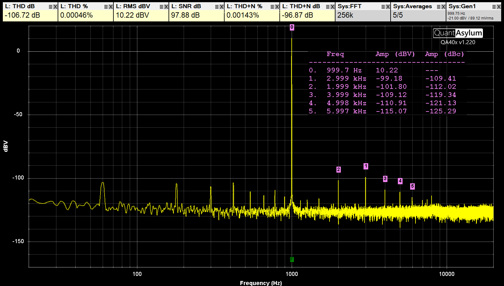
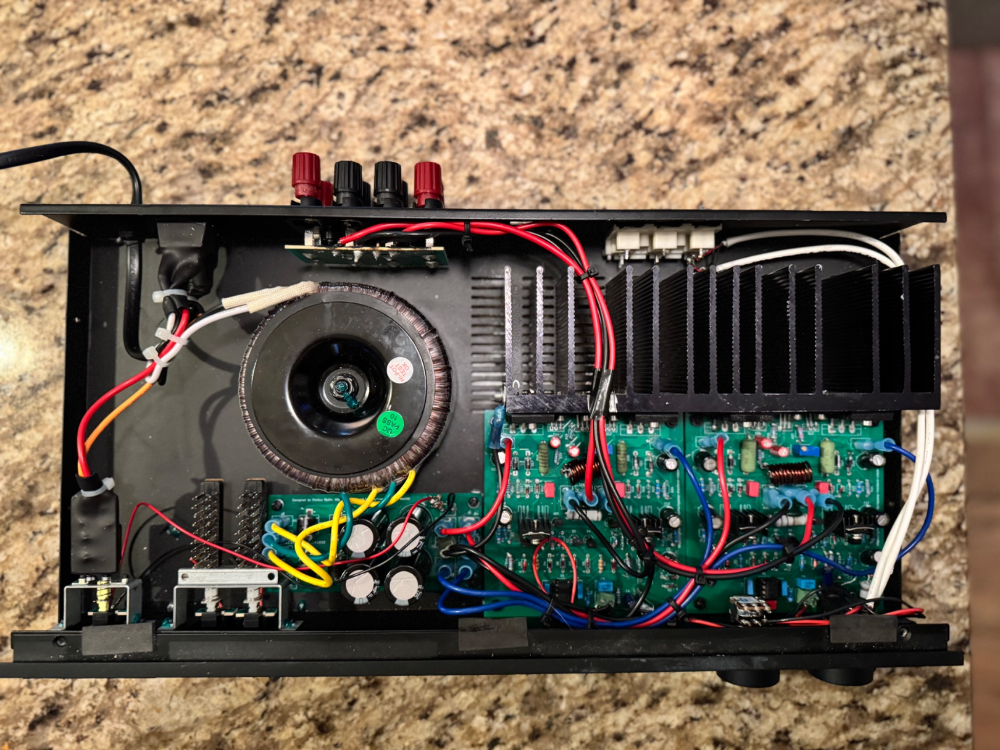

# The Teamwork Amplifier - 50W (8 ohm) Low Distortion Class AB Audio Amplifier

## Background
This is a team effort that started as a conversation on diyaudio.com. Member stigigemla and I were bouncing ideas back and forth and member steveu took one my design
attempts and came up with an overhauled and much improved version. I just added some extra features like overcurrent protecton and VI limiters and slapped together a PCB. 
I built it as an experiment.

The result is a fast amplifier (>80V/us slew rate) with low distortion (0.00045% meadured @ 1kHz/1W/8ohm resistive load). It's undergone some preliminary measurements
and looks quite promising. 

## Disclaimer
The schematic and PCB layout are free to use as you please, but bear in mind that it's only undergone a bare minimum of testing! Build at your own risk!

## Credits and acknowledgements
There were several people involved in the creation of this design. If you're not mentioned and feel you should be, just add your name and issue a PR! 

## Schematic

## PCB 3D rendering

## Measurements
- THD: 0.00045% @ 1W/1kHz/150mA bias
- SNR: >95dB
- Bandwidth: 10Hz-500kHz
- Slew rate: >80V/us

## Subjective listening impression
After a few hours of listening, I have to say I'm pleased with the sound quality. It character is very crisp and clean. Drum beats and cymbals feel very snappy. 
If you're looking for an amplifierthat colors the sound, this won't be your cup of tea. But so far I would say it does a great job at cleanly reproducing the source material. 

## Construction
I found an old, broken AudioSource Amp 100 on eBay for close to no money and reused the chassis, pots, connectors and transformer. The boards ended up fitting perfectly if
I moved the heatsink maybe 3mm back and removed the input switching board (which I didn't want or need anyway). It ended up being a neat and inexpensive build
that looks sleek and clean. 

