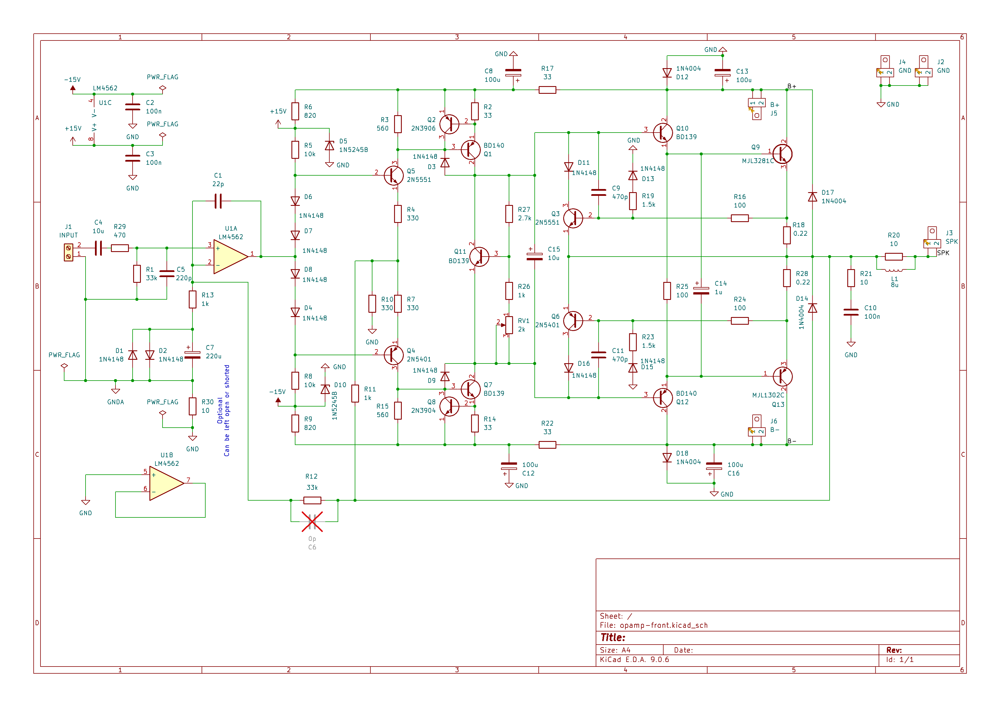

# The Teamwork Amplifier - 50W (8 ohm) Low Distortion Class AB Audio Amplifier

## Background
This is a team effort that started as a conversation on diyaudio.com. Member stigigemla and I were bouncing ideas back and forth and member steveu took one my design
attempts and came up with an overhauled and much improved version. I just added some extra features like overcurrent protecton and VI limiters and slapped together a PCB. 
I built it as an experiment.

The result is a fast amplifier (>40V/us slew rate) with low distortion (0.00086% meadured @ 1kHz/1W/8ohm resistive load). It's undergone some preliminary measurements
and looks quite promising. More measurements and listening tests are pending. 

## Disclaimer
The schematic and PCB layout are free to use as you please, but bear in mind that it's only undergone a bare minimum of testing! Build at your own risk!

## Credits and acknowledgements
There were several people involved in the creation of this design. If you're not mentioned and feel you should be, just dd your name and issue a PR! 

## Schematic

### PCB 3D rendering

